# benchmark-grafos-java-cpp

Projeto desenvolvido para a disciplina de Estrutura de Dados e Algoritmos do curso de Ciência da Computação da Universidade Federal de Campina Grande.

## Sumário

- [Introdução](#introdução)
- [Como rodar o experimento](#como-rodar-o-experimento)
  - [Dependências](#dependências)
  - [Comandos](#comandos)
- [Contextualização](#contextualização)
  - [Funcionamento das linguagens](#funcionamento-das-linguagens)
  - [Descrição dos quatro algoritmos escolhidos](#descrição-dos-quatro-algoritmos-escolhidos)
- [Metodologia](#metodologia)
  - [Primeiro passo: Implementação dos grafos](#primeiro-passo-implementação-dos-grafos)
  - [Segundo passo: Implementação dos algoritmos](#segundo-passo-implementação-dos-algoritmos)
  - [Terceiro passo: Geração de entradas](#terceiro-passo-geração-de-entradas)
  - [Quarto passo: Ambientes de teste e análise dos resultados](#quarto-passo-ambientes-de-teste-e-análise-dos-resultados)
- [Casos de teste](#casos-de-teste)
  - [DFS](#dfs)
  - [BFS](#bfs)
  - [Kruskal](#kruskal)
  - [Bellman-Ford](#bellman-ford)
- [Hipótese teórica](#hipótese-teórica)
- [Análise dos resultados](#análise-dos-resultados)
  - [Pico de memória RAM utilizada nas duas linguagens](#pico-de-memória-ram-utilizada-nas-duas-linguagens)
  - [Tempo de execução de cada algoritmo para ambas as linguagens](#tempo-de-execução-de-cada-algoritmo-para-ambas-as-linguagens)
- [Ameaças à validade do experimento](#ameaças-à-validade-do-experimento)
- [Conclusão](#conclusão)
- [Decisões metodológicas detalhadas](#decisoes-metodologicas-detalhadas)
- [Referências](#referências)

## Introdução

Java e C++ são duas linguagens de programação extremamente utilizadas nos mais diversos tipos de aplicações. Adotando abordagens distintas, C++ oferece um melhor controle de memória e tempo de execução, enquanto Java se destaca na portabilidade e acionamento automático do Garbage Collector. Na prática, o desempenho de um algoritmo pode ser diretamente impactado pela escolha da linguagem em que será implementado. Nesse projeto, iremos realizar um estudo comparativo de desempenho de algoritmos clássicos de grafos, avaliando sua eficiência na prática quando implementados nessas duas linguagens.

## Como rodar o experimento

### Dependências

**Linguagens**
- Java
- C++
- Python 3

**Bibliotecas**
- Maven
- Matplotlib
- Google Benchmark

### Comandos

```bash
# roda os testes
chmod +x run-benchmark.sh
nohup ./run-benchmark.sh > log_execucao.txt 2>&1 &

# verifica o progresso
tail -f log_execucao.txt

# verifica se ta rodando
ps aux | grep run-benchmark
```
## Contextualização

Para avaliar a eficiência prática de BFS, DFS, Kruskal e Bellman-Ford em Java e C++, foram medidos o tempo de execução e o pico de memória utilizada em cada algoritmo, variando o tamanho e a estrutura dos grafos de entrada. Essas escolhas, visam identificar não apenas qual das duas linguagens é mais rápida, mas também em quais condições e por quais motivos a diferença de performance acontece.

### Funcionamento das linguagens

Java é uma linguagem compilada e interpretada, em que, durante o processo de rodar um programa, ele será transformado em uma versão em bytecode que ficará no formato para que uma máquina virtual (JVM) possa executá-la. Essa JVM realiza algumas alocações de memórias, guardando as classes do programa, métodos e variáveis a serem utilizados. Além disso, há um controle de memória não utilizada feito automaticamente pelo Garbage Collector. Durante o começo da execução de um programa, a JVM inicia interpretando linha por linha, o que é algo demorado, mas, após um tempo, identifica trechos executados com frequência por meio da compilação JIT, melhorando o tempo de execução. Essas otimizações feitas pelo Java, facilitam o trabalho do programador e são fundamentais para a portabilidade da linguagem, mas podem prejudicar o desempenho em certos momentos.

Já o C++, é uma linguagem compilada em que o código é transformado diretamente em código de máquina nativo por um compilador, sem precisar ser transformado em bytecode e sem depender de uma máquina virtual para ser executado (fazendo com que perca portabilidade). Por conta disso, o programa já fica pronto para rodar diretamente no processador, tornando-se um processo muito mais rápido para execução do que no Java. Entretanto, a alocação e remoção de objetos na memória é feita manualmente pelo programador, já que não existe um Garbage Collector cuidando disso. Com isso, quem monta o programa tem muito mais controle sobre o uso de memória e desempenho, mas tem mais responsabilidades sobre os erros que podem ser causados.

### Descrição dos quatro algoritmos escolhidos

**Busca em Profundidade (DFS)**
O DFS é um algoritmo que tem como objetivo visitar todos os vértices alcançáveis de uma origem, explorando cada ramo o mais fundo possível antes de retroceder. Ele é usado por exemplo para detecção de ciclos, ordenação topológica e busca de componentes conexos.

Cada vértice é visitado exatamente uma vez, marcado como usado logo na primeira visita, o que garante que nenhum vértice seja processado novamente. Para cada vértice visitado, o algoritmo percorre sua lista de adjacência inteira para descobrir os vizinhos, e cada aresta aparece na lista de adjacência de seus dois extremos (grafo bidirecional). Como cada aresta é percorrida um número constante de vezes ao longo de toda a execução.


**Busca em Largura (BFS)**
O BFS também é um algoritmo de percurso em grafos, mas com o objetivo de explorar os vértices por níveis de distância a partir de uma origem, visitando primeiro todos os vizinhos diretos antes de avançar. É o algoritmo indicado quando se busca o menor caminho em número de arestas, como em cálculo de grau de separação ou busca de redes.

O raciocínio é o mesmo do DFS, muda apenas a estrutura de controle, que no BFS cada vértice entra e sai da fila exatamente uma vez O(V), e ao processar um vértice, a lista de adjacência inteira é percorrida para enfileirar os vizinhos não visitados, o que soma O(E) ao longo de toda a execução. Por isso, BFS e DFS compartilham a mesma complexidade assintótica, ainda que com constantes e padrões de acesso à memória diferentes.


**Algoritmo de Kruskal**
O Kruskal é um algoritmo guloso que tem como objetivo construir a árvore geradora mínima de um grafo ponderado e conexo, a subárvore que conecta todos os vértices com o menor peso total de arestas e sem gerar ciclos para garantir a propriedade de árvore. É indicado em problemas de otimização de custo em redes, como projeto de infraestrutura de menor custo (elétrica, água, telecomunicações).

Possui duas fases com custos distintos. A primeira é a ordenação das E arestas por peso para aplicação do guloso sempre escolhendo a aresta de menor peso. A segunda fase percorre as arestas já ordenadas uma única vez. Primeiramente é verificado se a adição dessa aresta gera um ciclo considerando as que já foram adicionadas. Caso não gere, a aresta é adicionada no novo grafo e a próxima é verificada. Após cada adição de aresta, se o grafo gerado possuir V - 1 arestas, a árvore pôde ser formada, caso o laço termine e esse número não foi alcançado, não foi possível formar. A verificação de ciclos por padrão é feita utilizando o algoritmo de DSU, checando se os vértices estão no mesmo componente. Para entender melhor o funcionamento da DSU clique [aqui](https://cp-algorithms.com/data_structures/disjoint_set_union.html).

**Algoritmo de Bellman-Ford**
Bellman-Ford é um algoritmo que tem como objetivo encontrar o caminho mínimo de um vértice de origem para todos os demais vértices de um grafo ponderado e direcionado. Ele é indicado quando o grafo pode conter arestas de peso negativo ou até quando é preciso sinalizar a existência de ciclos negativos.

O algoritmo repete um laço de relaxamento sobre todas as E arestas, que serve para atualizar a menor distância encontrada para aquele vértice. Ao realizar esse processo por V - 1 vezes, é garantido que serão calculadas corretamente as distâncias para todos os vértices do grafo (desde que não haja algum ciclo negativo). Para os vértices inalcançáveis, a distância para eles ficará igual a infinito.


| Algoritmo | Complexidade (melhor caso) | Complexidade (pior caso) |
|---|---|---|
| DFS | O(V + E) | O(V + E) |
| BFS | O(V + E) | O(V + E) |
| Kruskal | O(V) | O(E log E) |
| Bellman-Ford | O(E) | O(V · E) |

## Metodologia

A pesquisa adotou uma abordagem experimental controlada, seguindo esses passos:

### Primeiro passo: Implementação dos grafos

Os vértices são apenas representados como inteiros, não guardando informações adicionais, a fim de simplificar a implementação dos testes. Cada inteiro é um identificador de um vértice que corresponde à sua ordem de inserção no grafo. Todos os grafos são 1-indexados. Nenhum dos grafos usados é garantidamente conectado.

- Para grafos não ponderados e bidirecionais usados na BFS e DFS, foram usadas listas de adjacência (listas de listas de inteiros) para a representação do grafo, sendo cada posição da lista a representação de um vértice e cada elemento dessa lista um vizinho do vértice correspondente.
- Para grafos direcionados e ponderados, foram usadas classes e estruturas de arestas, guardando o vértice de origem, vértice de destino e peso da aresta como inteiros. Para a representação dos grafos, foram usadas listas de arestas. A ausência de um vértice na lista de arestas não significa a inexistência dele no grafo, apenas indica a ausência de conexões com outros vértices, de fato, o grafo sempre possui a quantidade de vértices indicada no teste.

### Segundo passo: Implementação dos algoritmos

- **DFS** — Implementação recursiva, caminhando uma vez por todos os vértices do grafo, mesmo com grafos desconectados. Evita caminhar por vértices usados com um array de booleanos marcando os vértices usados.
- **BFS** — Implementação iterativa usando uma `Queue` de vértices para garantir o caminhamento em largura e um array de booleanos marcando vértices usados. Caminha por todos os vértices do grafo, mesmo que seja desconectado.
- **Kruskal** — Implementação gulosa, ordenando a lista de arestas por seus pesos e escolhendo sempre a menor aresta disponível que não gera ciclos para adicionar à árvore. A implementação da DSU usa um array de inteiros para representar os pais, sendo as raízes dos componentes representadas por números negativos indicando a quantidade de vértices em seu componente, e um inteiro representando o pai do vértice para os outros casos. Caso a quantidade de arestas necessária para formar uma árvore seja alcançada, o algoritmo é encerrado precocemente.
- **Bellman-Ford** — Implementação dinâmica que percorre a lista de arestas $V - 1$ vezes (onde $V$ é a quantidade de vértices), atualizando as distâncias mínimas, e verifica uma última vez para averiguar a existência de ciclos negativos. Caso uma iteração por todas as arestas aconteça sem que nenhuma distância seja atualizada, o algoritmo é encerrado precocemente, já que todas as distâncias mínimas já foram encontradas.

> Para melhor entendimento do funcionamento de cada algoritmo, verifique as versões didáticas dos códigos nas duas linguagens usadas no projeto no diretório `algoritmos`.

### Terceiro passo: Geração de entradas

A geração dos grafos foi feita por meio de um algoritmo em Python, explorando 5 casos para cada algoritmo. Para os casos que testam densidades diferentes, é importante ressaltar que os grafos não seguem a proporção em relação à densidade máxima de um grafo, isto é, $V \cdot (V - 1)$. Ao invés disso, é usada uma proporção diferente calculada empiricamente. Para entender melhor essa escolha e o cálculo das proporções, confira a seção [Decisões metodológicas detalhadas](#decisoes-metodologicas-detalhadas).

**Tamanhos:** 10, 30, 100, 300, 1.000, 3.000, 10.000, 30.000, 100.000

**Casos:** Melhor, Pressão, Esparso, Médio, Denso

- **Melhor caso** — Refere-se a um grafo que estimula o melhor caso teórico de cada algoritmo, usado como base para controle e previsibilidade do experimento e comparação com outros casos.
- **Caso de pressão** — Refere-se a grafos que estruturalmente pressionam as linguagens para evidenciar a diferença de performance, sem necessariamente forçar um pior caso teórico. Esses casos se aproximam mais de situações realistas de representação e armazenamento de grafos. Para entender melhor os casos de pressão de cada algoritmo, confira a seção [Casos de teste](#casos-de-teste) (Nos arquivos gerados, o caso de pressão está denominado como "pior" para simplificar).
- **Esparso** — Caso com poucas arestas em relação ao número de vértices, mais precisamente 10% da densidade máxima calculada.
- **Médio** — Caso com um número intermediário de arestas em relação ao número de vértices, mais precisamente 50% da densidade máxima calculada.
- **Denso** — Caso com muitas arestas em relação ao número de vértices, mais precisamente 90% da densidade máxima calculada.

### Quarto passo: Ambientes de teste e análise dos resultados

Os testes foram rodados por meio de benchmarks, utilizando as bibliotecas Google Benchmark para C++ e JMH (Java MicroBenchmark Harness) para Java, que mediram o tempo de execução médio e o pico de memória para cada caso de cada algoritmo, variando o tamanho das entradas. Os resultados foram transferidos para arquivos `.json`, que foram então interpretados por um script em Python com o uso da biblioteca Matplotlib para montar a representação visual dos gráficos. Para cada teste foram realizadas 3 rodadas de aquecimento e 7 execuções para Java, e 7 execuções para C++ sem rodadas de aquecimento. Todos os testes foram realizados no mesmo computador, em uma sessão ininterrupta, apenas com o terminal aberto.

## Casos de teste

### DFS

- **Melhor caso — Árvore binária balanceada.** A árvore binária balanceada permite que a altura da árvore permaneça no máximo em $\log_2(V)$, o que faz com que, para a maior entrada com $10^5$ vértices, a altura máxima seja 17, o que mantém a pilha de recursão com uma quantidade pequena de vértices, otimizando todo o processo.
- **Caso de pressão — Grafo linear.** O grafo linear faz com que, para o maior número de vértices, o primeiro vértice esteja a 99.999 arestas de distância do último, estressando ao máximo o jeito que as linguagens tratam seus limites de chamadas recursivas. *Exemplo realista:* sequência de edições em um arquivo de texto.

### BFS

- **Melhor caso — Grafo linear.** O grafo linear permite que a fila da BFS armazene apenas um vértice simultaneamente, já que cada vértice só possui um vizinho ainda não usado. Isso otimiza o uso de memória e as operações da fila.
- **Caso de pressão — Árvore binária balanceada.** Na árvore balanceada, os níveis mais baixos possuem muitos vértices, logo a fila precisa armazenar muitos elementos de uma vez no final da execução. Para o maior tamanho de entrada, isso seria cerca de 500.000 vértices. Esse cenário testa a otimização de armazenamento em estruturas de dados para ambas as linguagens. *Exemplo realista:* árvore de arquivos e diretórios em um computador.

### Kruskal

- **Melhor caso — Árvore binária balanceada ordenada.** Este grafo gera uma lista de arestas já ordenadas, não sendo gasto tempo com a ordenação, e após o percorrimento de todas as arestas a árvore fica pronta, encerrando a execução no menor tempo possível.
- **Caso de pressão — Grafo fragmentado.** Esse grafo simula diversos grafos desconectados de tamanhos distintos, gerando um grau de desordem e forçando a DSU a não comprimir todos os caminhos rapidamente, para evidenciar a diferença entre as linguagens. *Exemplo realista:* grafo de seguidores em redes sociais, com alguns pontos servindo como hubs com grandes quantidades de vértices.

### Bellman-Ford

- **Melhor caso — Árvore binária balanceada.** Ao aplicar o algoritmo nesse grafo, todos os menores caminhos a partir da raiz serão encontrados em apenas uma iteração, já que só há como alcançar cada vértice por um único caminho a partir da raiz de uma árvore. Logo, na segunda iteração o algoritmo não realizará nenhuma troca, encerrando a execução precocemente.
- **Caso de pressão — Grafo matriz invertido.** Esse grafo se trata de uma matriz saindo do vértice $1{\times}1$ e construindo ligações para a direita e para baixo com os próximos vértices. A execução é realizada saindo da última aresta até alcançar a primeira, garantindo que o algoritmo não irá se encerrar em apenas uma iteração. Esse cenário simula uma matriz em que há diversos caminhos para sair de um vértice e chegar em outro, testando o armazenamento da estrutura e a performance em ambas as linguagens. *Exemplo realista:* casas em um jogo de tabuleiro.

Os casos esparsos, médios e densos são estruturalmente iguais para todos os algoritmos, com a única diferença sendo a adição de pesos aleatórios com valores entre $-300$ e $1000$ para os casos de Kruskal e Bellman-Ford. A quantidade de arestas para cada grafo é obtida através da fórmula explicada na seção [Decisões metodológicas detalhadas](#decisoes-metodologicas-detalhadas), e as arestas também são geradas aleatoriamente da seguinte forma: enquanto o número exigido de arestas não for alcançado, dois vértices aleatórios são selecionados. Caso não haja uma aresta entre eles ainda, a conexão é feita e adicionada à lista de arestas. Esse processo se repete até que seja obtido o número necessário de arestas.

## Hipótese teórica

Com base nos estudos teóricos feitos a partir das diferenças entre Java e C++ e das implementações dos quatro algoritmos de grafos, fizemos as seguintes previsões:

1. Em todos os algoritmos, o tempo de execução da implementação em C++ tende a ser mais rápido do que o de Java.
2. Para um número de vértices muito grande, a DFS em Java tende a estourar a pilha de recursão.
3. Nas implementações em Java, o pico de memória será mais inconstante para as entradas menores, visto que as alocações de memória da JVM terão maior impacto do que as operações de fato do programa.
4. A eficiência dos algoritmos, na análise do melhor caso de cada um, deve se aproximar da complexidade teórica estudada.

## Análise dos resultados

### Pico de memória RAM utilizada nas duas linguagens

Na escolha de qual linguagem escolher para cada caso de algoritmo, o pico de memória utilizada é uma métrica extremamente relevante a ser analisada, visto que será impactada pela quantidade de recursos disponíveis para rodar o programa.

Diferentemente do C++, que realiza alocações prévias na memória quase desprezíveis, a JVM do Java irá carregar várias classes que serão utilizadas no programa, inicializar o compilador e reservar uma quantidade de memória que ficará disponível para uso. Tudo isso é feito de forma fixa, sem influência do tamanho do programa que será executado. Por isso, em alguns casos, como o Bellman-Ford denso, o pico de memória em Java fica totalmente ofuscado por conta dessas reservas de memória e operações realizadas. Já em outros casos, como no gráfico de BFS médio abaixo, em um certo ponto, por volta de 30.000 vértices, como as estruturas de dados do algoritmo passam a ocupar mais memória do que o custo fixo da JVM, é observado um aumento drástico no pico de memória. Veja os dois gráficos abaixo:

<table>
  <tr>
    <td align="center"><b>Bellman-Ford — caso denso</b><br>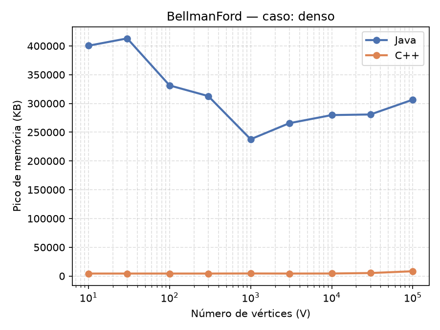</td>
    <td align="center"><b>BFS — caso médio</b><br>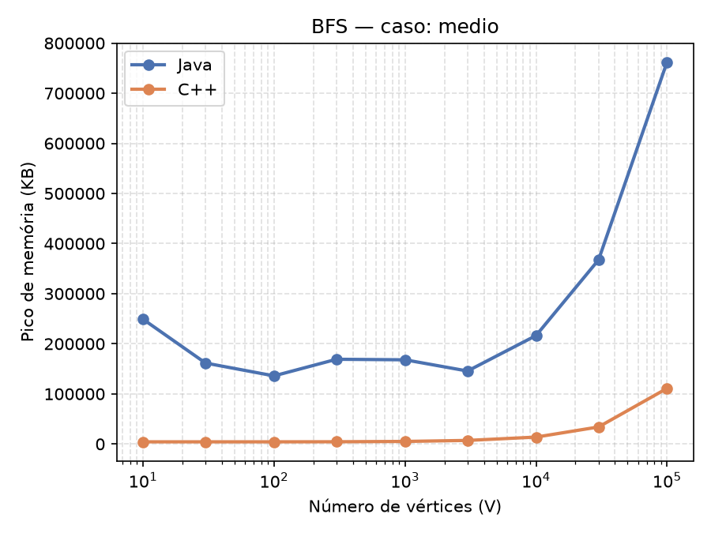</td>
  </tr>
</table>

### Tempo de execução de cada algoritmo para ambas as linguagens

**DFS — gráfico melhor caso, caso de pressão**

<table>
  <tr>
    <td align="center"><b>Melhor caso</b><br>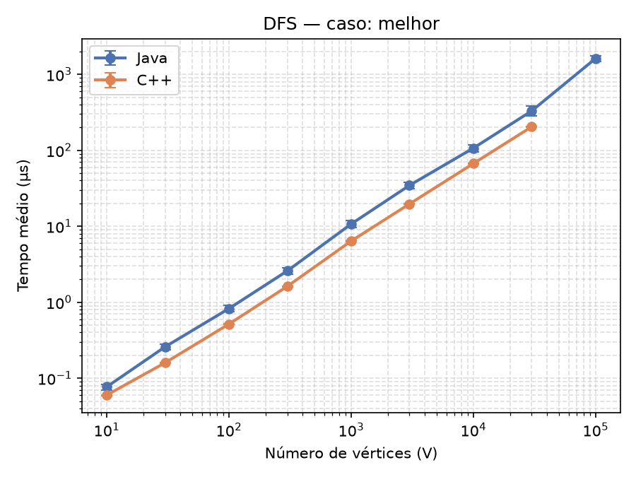</td>
    <td align="center"><b>Caso de pressão</b><br>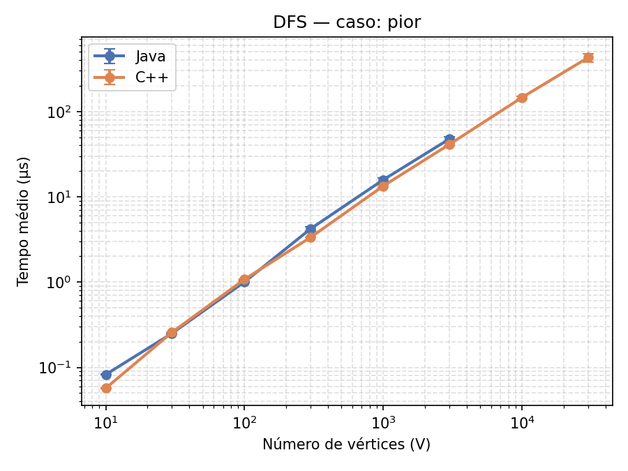</td>
  </tr>
</table>

Como pode ser visto, o gráfico de tempo de execução da DFS, tanto no melhor caso quanto no pior caso, se aproxima muito da complexidade teórica de $O(V + E)$, apresentando um crescimento linear. O principal fator que diferencia os dois casos é o alcance de cada linguagem: enquanto C++ alcança cerca de 70.000 chamadas recursivas em todos os casos, suportando até o caso de 30.000 vértices, as pilhas de recursão em Java começam a estourar a partir de 10.000 vértices, com exceção do melhor caso — confirmando a hipótese feita anteriormente.

Essa diferença entre as linguagens se deve provavelmente a alguns pontos-chave:

- Por padrão, em geral C++ aloca mais memória inicialmente para a pilha de recursão do que Java, dependendo do sistema operacional.
- Como a pilha de recursão é construída através de um empilhamento de *frames*, o tamanho desses frames influencia no preenchimento precoce da memória de recursão. Em Java, os objetos referenciados carregam mais informações do que estruturas equivalentes em C++, o que gera um *frame* menor para C++, possibilitando mais chamadas recursivas até estourar o limite. Isso pode ser atestado porque Java não possui uma otimização de chamada de cauda (*tail-call optimization*), diferentemente de C++, que possui essa otimização via compilador por meio da flag `-O2` (confira no arquivo `run-benchmark.sh`).

**BFS — gráfico melhor caso, caso de pressão**

<table>
  <tr>
    <td align="center"><b>Melhor caso</b><br>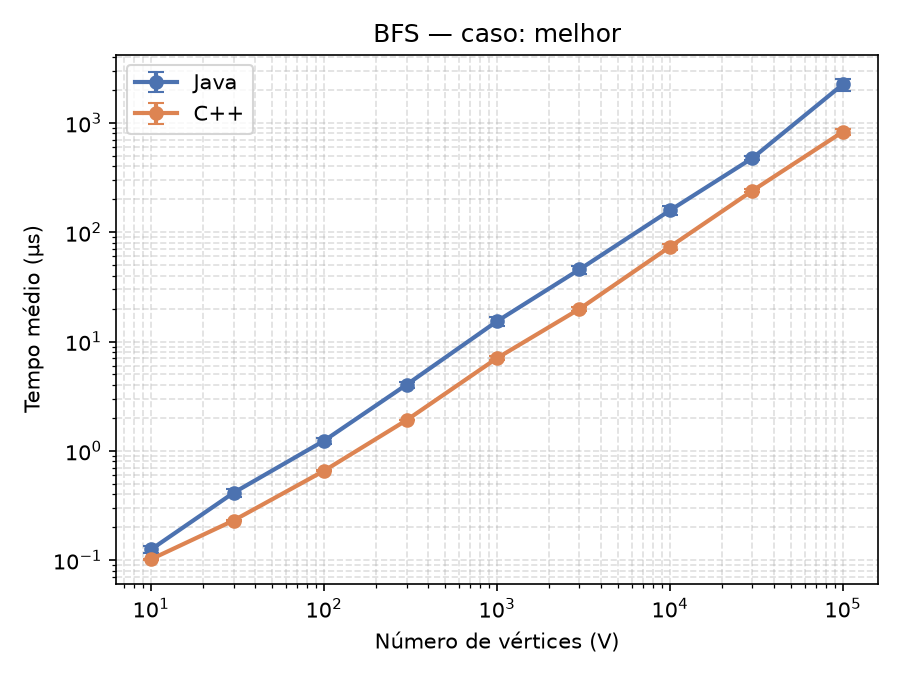</td>
    <td align="center"><b>Caso de pressão</b><br>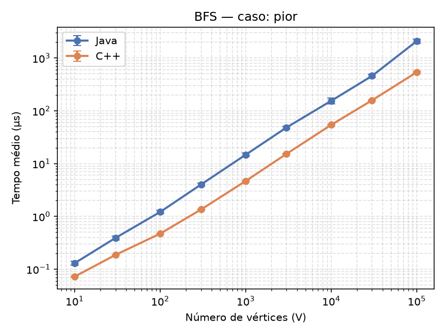</td>
  </tr>
</table>

Para a BFS, os gráficos também refletem a complexidade teórica de crescimento linear. É possível perceber que, para ambos os casos, a curva dentro de cada linguagem se mantém estável durante todos os testes, porém no pior caso a distância entre as curvas é maior em relação ao melhor caso. Isso indica que C++ lida melhor com uma sobrecarga na fila do que Java. Para o melhor caso, com a fila sempre possuindo apenas um nó, a diferença de performance não é tão discrepante. Isso se deve provavelmente ao overhead de Java, que contém um excesso de ponteiros para uma quantidade relevante de vértices, o que torna o acesso a objetos e o armazenamento ineficientes.

**Kruskal — gráfico melhor caso, caso de pressão**

<table>
  <tr>
    <td align="center"><b>Melhor caso</b><br>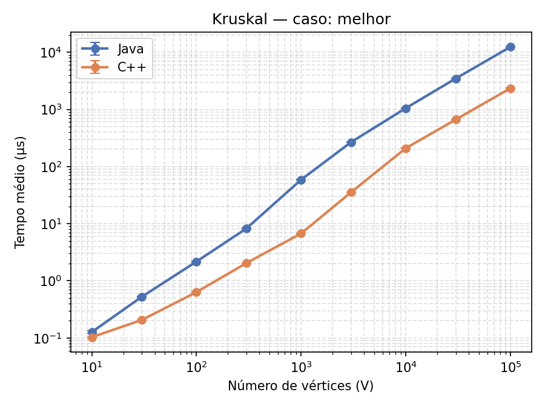</td>
    <td align="center"><b>Caso de pressão</b><br>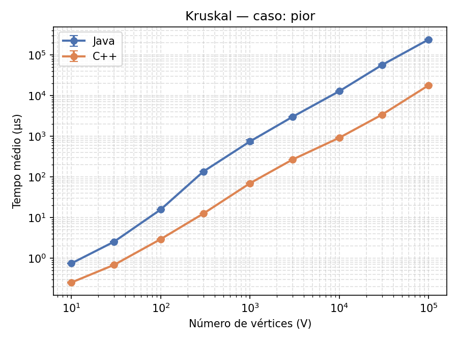</td>
  </tr>
</table>

Os gráficos do Kruskal batem com a teoria (O(E log E)), crescendo de forma parecida com uma reta na escala log-log. A diferença entre os dois casos está na distância entre Java e C++: no melhor caso essa distância é sempre a mesma. No caso de pressão, ela cresce bastante nas entradas maiores. Isso acontece porque:

- No caso de pressão, o grafo é bem fragmentado (cheio de pedaços soltos), o que deixa a DSU menos eficiente.
- Em Java, cada aresta é um objeto solto na memória. Em C++, as arestas ficam todas juntinhas. Isso importa mais quando os dados estão bagunçados, como no caso de pressão.
- A forma como cada linguagem ordena também pesa. Em C++ é mais rápido porque mexe direto na memória, em Java é mais lento porque mexe em objetos.
- Apesar da complexidade do melhor caso teórico ser O(V) por uma ausência de necessidade de ordenação das arestas, as funções padrão de ordenação de C++ e Java não checam se a estrutura já está ordenada antes, por isso o cresimento se manteu próximo de V log V

**Bellman-Ford — gráfico melhor caso, caso de pressão**

<table>
  <tr>
    <td align="center"><b>Melhor caso</b><br>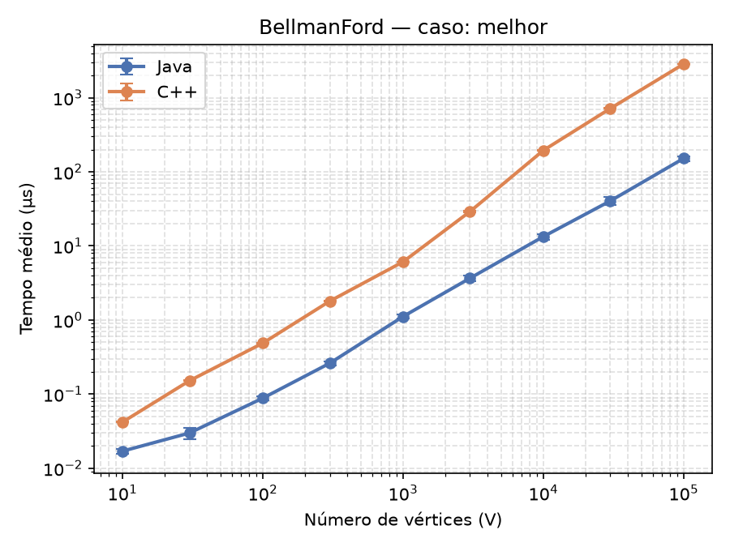</td>
    <td align="center"><b>Caso de pressão</b><br>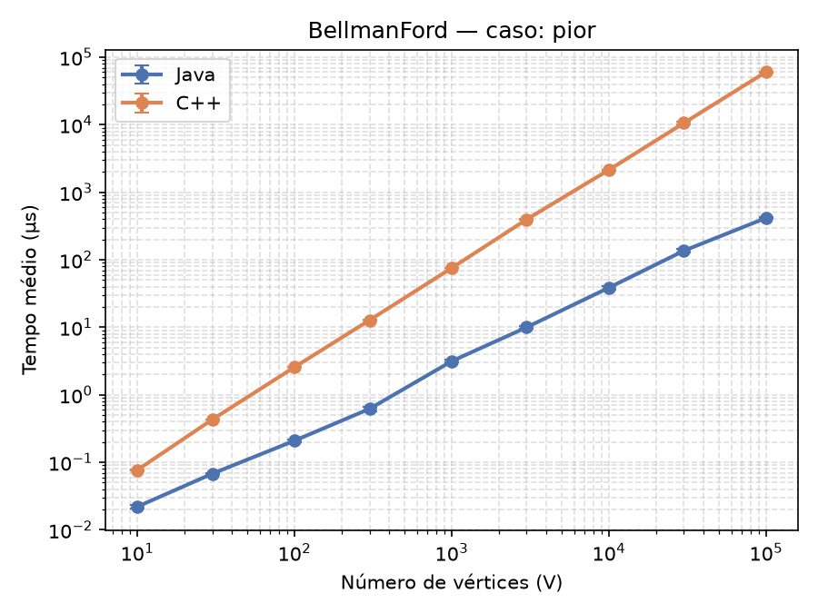</td>
  </tr>
</table>

Os gráficos do Bellman-Ford também batem com a teoria: melhor caso quase linear (O(E)), caso de pressão crescendo mais rápido (O(V·E)). A diferença entre os dois casos é o quanto Java e C++ ficam parecidos: no melhor caso, quase iguais. No caso de pressão, Java varia bem mais. Isso acontece porque:

- No melhor caso, o algoritmo termina rápido, então não dá tempo do Java ser impactado com o Garbage Collector.
- No caso de pressão, o algoritmo roda muito mais vezes, usa mais memória, e o Garbage Collector do Java entra em ação em momentos diferentes a cada teste, por isso os tempos variam mais.
- Diferente do Kruskal, Java e C++ tendem a se aproximar quando o algoritmo vira só uma sequência gigante de contas simples, porque depois que "esquenta", o Java compila isso quase tão bem quanto o C++.

<p align="center"><b>Caso denso</b><br>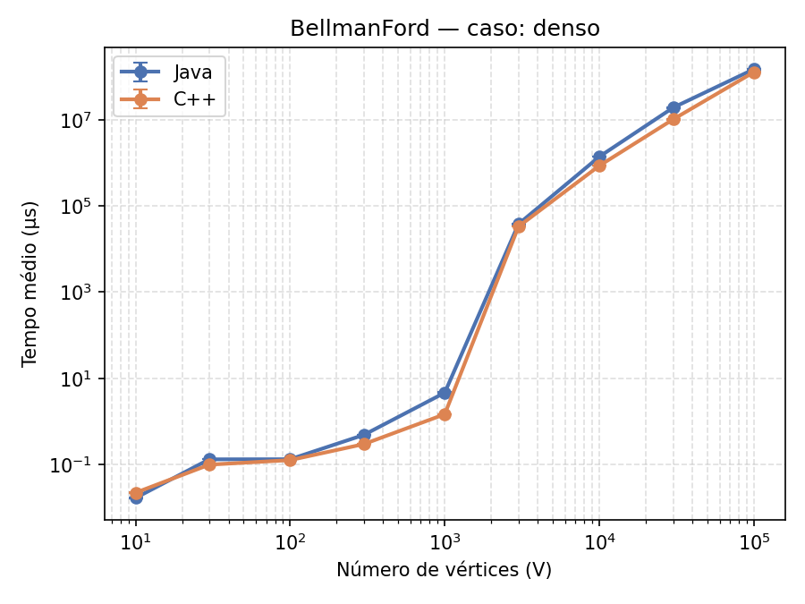</p>

Como visto no gráfico acima, para o caso denso com um volume maior de arestas, o crescimento do tempo de execução cresce de forma ainda mais parecida com um crescimento quadrático, já que o número de arestas é na mesma ordem do número de vértices. É possível perceber também que para as quantidades maiores de vértices, há um salto brusco no tempo de execução do algoritmo. Isso ocorre porque a partir de um certo número de arestas, a probabilidade de ocorrer um ciclo negativo escolhendo os pesos de forma aleatória cresce muito, fazendo com que os grafos a partir de 3.000 arestas caiam no pior caso, forçando a execução do algoritmo até o final. Note também que para a maioria dos casos a diferença de performance entre Java e C++ é ínfima, possuindo pontos quase sobrepostos para alguns casos, o que indica que em alguns cenários, a escolha da linguagem não possui impacto significativo no tempo de execução.

## Ameaças à validade do experimento

1. **Resultados DFS** — Nas análises de tempo de execução da DFS em Java, exceto no melhor caso (em que o grafo é uma árvore balanceada), a pilha de recursão de Java fica sobrecarregada quando há um aumento grande no número de vértices, gerando erros de `StackOverflowError`. Além disso, na DFS em C++ foi colocada uma verificação de segurança, por motivos do hardware utilizado, em que para um número de vértices maior ou igual a 70.000 a execução do benchmark é encerrada, fazendo com que na análise do melhor caso a execução em C++ termine antes da execução em Java, mesmo sem estourar a pilha de execução.
2. **Quantidade de repetições para tempo de execução** — Em cada caso de algoritmo foram feitas 3 repetições de aquecimento para Java e calculada a média entre 7 repetições de medição para a métrica de tempo de execução nas duas linguagens, o que pode causar distorções nos resultados medidos (visto que quanto mais repetições, mais fiel será o resultado observado).
3. **Medição da memória** — Diferente da medição de tempo de execução, que utiliza séries de aquecimento e média de séries de repetições, a medição de memória é feita em um caso único (com apenas 1 série de aquecimento em Java), gerando distorções como maior pico de memória em Java para um número de vértices menor. A comparação, portanto, fica mais fiel ao analisar os números maiores de vértices.
4. **Grafos gerados** — Os resultados do experimento são válidos em cenários com os grafos que foram gerados de forma controlada. Na utilização real, grafos são gerados de formas mais desiguais do que as testadas na análise desse projeto.
5. **Densidade máxima não testada** — Não foram testados grafos com densidade máxima (para mais detalhes, veja a explicação detalhada da densidade dos grafos na seção [Decisões metodológicas detalhadas](#decisoes-metodologicas-detalhadas)).

## Conclusão

A partir dos resultados do experimento, tendo em vista a metodologia adotada pelo estudo e que os gráficos de tempo de execução se aproximaram bastante da hipótese assintótica prevista, observam-se os seguintes fatos: 

- Os tempos de execução dos algoritmos em Java mostraram-se não muito distantes dos em C++, contrariando a hipótese feita antes do experimento. Acreditávamos que os em C++ sempre seriam muito superiores. Na realidade, em alguns casos (como o Bellman-Ford denso), as linhas chegavam a se sobrepor, o que indica que o tempo de execução nas duas linguagens, para um número maior de vértices e após séries de aquecimento no java, pode ser sim muito semelhante. Mesmo assim, o tempo de execução do C++, no geral, foi mais rápido.
- Nas análises de pico de memória, o Java provou-se menos eficiente do que o C++, confirmando a previsão feita no início do estudo. Em todos os gráficos gerados, o Java teve um pico muito mais alto e, em muitos cenários, inconstância na forma de alocar essa memória, em que um número de vértices menor gerava um pico mais alto do que com números maiores de vértices, tornando-se, na metodologia adotada pelo experimento, muito difícil prever o pico de memória para entradas pequenas (como discutido na seção de ameaças a validade).

Portanto, a partir desse estudo, pode-se concluir que a escolha de qual linguagem utilizar para seu programa deve levar em conta diversos fatores. Para cenários em que haverá um grande volume de operações ou em que a disponibilidade de recursos de memória é mais baixa, como sistemas embarcados ou máquinas com hardware limitado, visando melhor manejo dos recursos e performance, o C++ acaba sendo uma escolha mais racional. Já quando não há essa preocupação por recursos e tempo de execução quase perfeito, o Java é uma ótima escolha, além de entregar mais facilidade pro programador e uma boa portabilidade para o programa.


## Decisões metodológicas detalhadas

**Por que os tipos de grafos selecionados foram esses?**

Para DFS e BFS, não há impacto no tempo de execução sendo as arestas ponderadas ou não; adicionar peso nas arestas só aumentaria a complexidade dos grafos desnecessariamente. Já para Kruskal e Bellman-Ford, as arestas precisam ter peso, já que envolvem otimização de custos dos grafos. A lista de adjacência para DFS e BFS facilita a verificação dos vizinhos de um vértice; já a lista de arestas para Kruskal e Bellman-Ford facilita a ordenação por pesos e o caminhamento por arestas.

Tanto a DFS quanto a BFS permitem o uso de arestas bidirecionais, e sua escolha se deve ao fato de que a chance de vértices inalcançáveis para grafos com arestas bidirecionais é reduzida, já que é necessária apenas uma aresta conectada ao vértice. O algoritmo de Bellman-Ford exige que as arestas sejam unidirecionais, e para Kruskal não há diferença; portanto, por motivos de simplicidade, foi decidido usar o mesmo tipo de aresta do Bellman-Ford. Os vértices serem 1-indexados é uma escolha arbitrária para facilitar o entendimento.

**Por que foram escolhidos esses números de vértices para os testes?**

Grafos com tamanhos iguais a potências de 10, de $10^1$ a $10^5$, evidenciam bem a performance do algoritmo em casos básicos até casos extremos com grandes volumes de dados; potências acima de $10^5$ aumentam drasticamente o tempo de teste e a quantidade de operações para alguns casos, tornando os testes inviáveis. Os valores intermediários na proporção $1/3/10$ servem para preencher melhor os gráficos e evitar saltos bruscos de execução entre pontos vizinhos. Como a escala no gráfico cresce em proporção logarítmica, as proporções de 3 ficam aproximadamente no meio das potências de 10, já que $\log_3(10) \approx 0{,}48$.

**Por que a execução do melhor caso da DFS em C++ para em 30.000?**

Foi testado localmente o limite recursivo para C++, alcançando cerca de 70.000 chamadas antes do estouro de pilha. Para evitar um erro que interromperia a execução dos testes e potencialmente corromperia os dados obtidos, foi colocada uma trava no algoritmo dos testes para não executar os casos em C++ com mais de 70.000 vértices.

**Grafo direcionado em Kruskal**

Vale ressaltar que, apesar dos grafos em Kruskal serem direcionados, a DSU trata as conexões entre vértices de forma bidirecional, não se importando com a origem e o destino. Portanto, para fins do experimento, foi considerada árvore um grafo com componente único, com todos os vértices conectados e uma quantidade de arestas igual a $V - 1$, não sendo necessário um vértice raiz que alcance todos os outros.

**Densidade dos grafos**

Um grafo pode ser considerado denso se o número de arestas que possui se aproxima do número máximo para a quantidade de vértices, que seria $V \cdot (V - 1)$ para grafos direcionados. Porém, como o pior caso de Bellman-Ford apresenta complexidade assintótica $O(V \cdot E)$, um grafo denso testado com a maior entrada possível ($10^5$ vértices) teria na ordem de $10^{10}$ arestas, gerando um caso com cerca de $10^{15}$ operações. Esse número torna o caso inviável para testes, já que uma única execução tomaria cerca de 200 dias, e mesmo que o número fosse reduzido, qualquer densidade de arestas que se aproximasse da ordem de $V^2$ levaria um tempo além do aceitável.

Logo, para esse experimento foi utilizada uma escala de crescimento de densidade linear, tomando uma constante como reguladora, através da seguinte fórmula:

$$E(V) = k \cdot V \cdot \log V$$ (base 10)

Essa fórmula é obtida tomando como base o limiar teórico da conectividade de Erdős–Rényi. Uma quantidade de arestas acima disso diminuiria muito a probabilidade de grafos desconectados serem gerados para entradas grandes, enfraquecendo a representatividade real do experimento. *(Note que o grafo aleatório de Erdős–Rényi é construído de forma diferente da desse experimento; portanto, a fórmula é uma estimativa grosseira.)*

Quanto à constante $k$, foi obtida de forma empírica com um teste para o pior caso. Uma execução com $10^{10}$ operações demorou cerca de 3 minutos em Java, número que para 10 repetições resultava em um valor aceitável. A constante foi regulada a partir desse valor, seguindo uma proporção de 90%:

$$O(V \cdot E) = 10^{10}$$
$$10^5 \cdot E = 10^{10} \implies E = 10^5$$
$$10^5 = k_{90} \cdot 10^5 \cdot \log(10^5)$$
$$10^5 = k_{90} \cdot 10^5 \cdot 5 \log 10$$
$$k_{90} = \dfrac{10^5}{10^5 \cdot 5} = 0{,}2$$

Como essa constante é 90% da constante usada para os outros casos:

$$k = \dfrac{0{,}2}{0{,}9} \approx 0{,}222\ldots$$

Os casos esparsos e médios seguem uma proporção de 10% e 50% dessa constante, respectivamente.

A desvantagem desse método é o baixo número de arestas para casos com poucos vértices: $E(10) = 0{,}2 \cdot 10 \log 10 = 2$. Por isso, para os outros algoritmos que não são tão limitados pelo tempo, são usadas 100 vezes mais arestas para todos os casos.

**Tamanho dos componentes do grafo fragmentado**

Para simular melhor um cenário real, o tamanho dos componentes do grafo não poderia ser igual para todos. Por isso, os vértices são divididos em $V / 5$ componentes com tamanhos decrescentes, seguindo a proporção:

$$\frac{V}{i^{\,s}}$$

onde $V$ é o número de vértices do grafo, $i$ é o índice do componente (começando em 2, para evitar um componente com todos os vértices) e $s$ é o fator de controle do quão desigual é a distribuição. Para esse experimento, foi arbitrariamente escolhido $s = 1{,}5$.

Após a distribuição de tamanhos, caso a soma de todos os tamanhos não dê exatamente igual à quantidade de vértices, a diferença é subtraída do maior componente, já que ele é menos sensível a pequenas alterações. Por fim, são gerados $V / 5$ subgrafos aleatórios, garantidamente conectados.

## Referências

- https://roadmap.sh/java/vs-cpp
- https://cp-algorithms.com/
- https://teses.usp.br/teses/disponiveis/104/104131/tde-12082019-155714/pt-br.html
